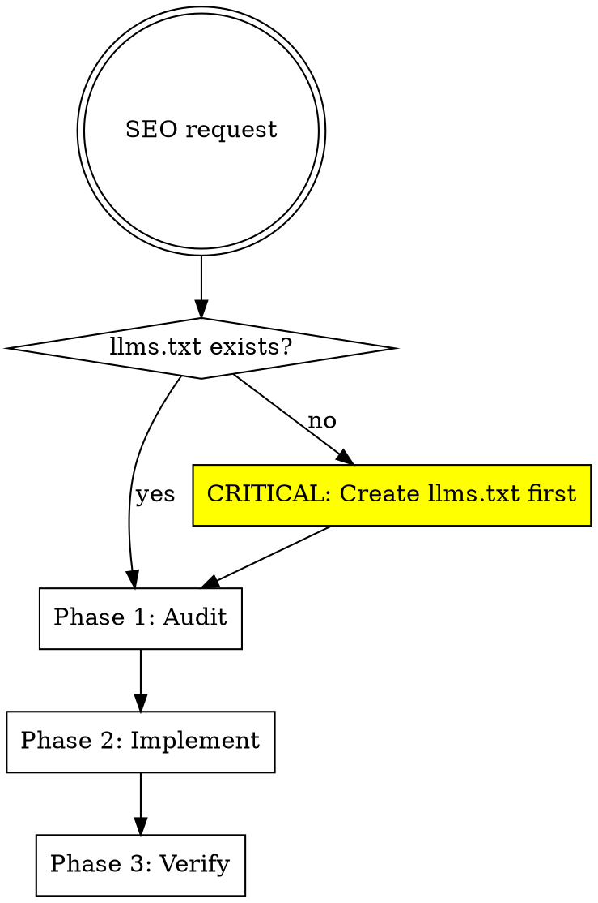

# SEO and LLM Visibility Optimization

## Overview

**Systematic approach to search engine and LLM discoverability.** Audit → Implement → Verify.

**Core principle:** LLM visibility (`llms.txt`) is equally important as traditional SEO. Many agents skip it.

## When to Use

Use when:
- Site needs SEO optimization
- Adding structured data (JSON-LD)
- Making site discoverable by ChatGPT, Perplexity, Claude
- Auditing existing meta tags
- **Critical**: If `llms.txt` doesn't exist

Don't use for:
- Marketing strategy
- Content writing
- Keyword research
- Backlink building

## Three-Phase Workflow



### Phase 1: Audit (What's Missing?)

**Check existing implementation before adding anything:**

| Item | Check | Script |
|------|-------|--------|
| llms.txt | `public/llms.txt` or `static/llms.txt` exists? | `audit-seo.sh` |
| Meta tags | Title, description, OG tags on all pages | `audit-seo.sh` |
| Structured data | JSON-LD scripts present? | `audit-seo.sh` |
| Sitemap | `sitemap.xml` or `app/sitemap.ts` | Manual check |
| robots.txt | Allows LLM bots (GPTBot, CCBot, anthropic-ai) | Manual check |

**Run audit script:**
```bash
./.claude/skills/seo-optimization/scripts/audit-seo.sh
```

### Phase 2: Implement (Fix What's Missing)

**Priority order:**

1. **llms.txt (CRITICAL)** - Most agents forget this
   ```bash
   ./.claude/skills/seo-optimization/scripts/generate-llms-txt.sh
   ```

2. **Structured Data** - Use generator
   ```bash
   ./.claude/skills/seo-optimization/scripts/generate-json-ld.js [type]
   ```

3. **Meta Tags** - Audit first, then add missing only

4. **Sitemap** - Framework-specific (Next.js, etc.)

5. **robots.txt** - Allow LLM bots

### Phase 3: Verify (Test Before Claiming Done)

**Required validation:**

| Tool | Purpose | URL |
|------|---------|-----|
| Google Rich Results | Validate structured data | search.google.com/test/rich-results |
| Schema Validator | Verify JSON-LD syntax | validator.schema.org |
| Meta Tags Check | Audit all meta tags | metatags.io |
| llms.txt Syntax | Markdown lint | Manual review |

**Verification checklist:**
- [ ] llms.txt accessible at `/llms.txt`
- [ ] Structured data validates (no errors)
- [ ] Meta tags present on all pages
- [ ] Sitemap includes all routes
- [ ] robots.txt allows LLM bots

## Scripts Reference

See `scripts/` directory for tools:

| Script | Purpose |
|--------|---------|
| `audit-seo.sh` | Scan site for missing SEO elements |
| `generate-llms-txt.sh` | Create llms.txt from project structure |
| `generate-json-ld.js` | Generate JSON-LD for common schemas |

## llms.txt Format

**Critical file for LLM discoverability.** Format:

```markdown
# Site Name

> Brief description

## About

What this site does, who it's for

## Content

- Blog posts about X
- Products/services
- Documentation

## Contact

How to reach you
```

Place at `public/llms.txt` or `static/llms.txt` depending on framework.

## Common JSON-LD Schemas

**Generate with script, don't write manually.**

| Schema Type | Use Case |
|-------------|----------|
| Organization | Business info |
| Product | E-commerce items |
| Article/BlogPosting | Blog posts |
| BreadcrumbList | Navigation |
| WebSite | Site-level data |

**Generate:**
```bash
# Organization schema
./scripts/generate-json-ld.js organization "Site Name" "https://site.com"

# Product schema
./scripts/generate-json-ld.js product "Product Name" 29.99

# Article schema
./scripts/generate-json-ld.js article "Post Title" "Author Name"
```

## Red Flags - STOP

If you're:
- Writing JSON-LD manually without using script
- Adding structured data without auditing first
- **Skipping llms.txt** (most common mistake)
- Adding features beyond scope (security headers, etc.)
- Not verifying with validation tools

**All of these mean: Return to workflow, follow systematically**

## Common Rationalizations

| Excuse | Reality |
|--------|---------|
| "Comprehensive implementation is faster if I write everything manually" | Scripts prevent errors, ensure consistency. Use them. |
| "I know JSON-LD syntax, I'll just write it" | Manual writing = typos, schema errors. Use generator. |
| "llms.txt can wait until after launch" | LLMs won't discover your site. Critical first step. |
| "I'll audit after implementation" | You'll duplicate or conflict with existing code. Audit first. |
| "Validation takes too much time" | Invalid structured data = wasted implementation. Verify always. |

**Violating these principles = failing to follow the skill**

## Next.js Specific

**Metadata API (app router):**
```typescript
export const metadata: Metadata = {
  title: "Page Title",
  description: "Page description",
  openGraph: { /* OG tags */ },
};
```

**Sitemap:**
```typescript
// app/sitemap.ts
export default function sitemap(): MetadataRoute.Sitemap {
  return [/* routes */];
}
```

**JSON-LD in layout:**
```tsx
<script
  type="application/ld+json"
  dangerouslySetInnerHTML={{ __html: JSON.stringify(schema) }}
/>
```

## Common Mistakes

| Mistake | Fix |
|---------|-----|
| No llms.txt | Create first, it's critical for LLM discovery |
| Manual JSON-LD | Use generator script |
| No audit | Check what exists before adding |
| Skip verification | Use validation tools before claiming done |
| Over-engineering | Stick to requested scope only |

## Real-World Impact

- llms.txt: Makes site discoverable by ChatGPT, Perplexity, Claude
- Structured data: Rich results in Google search (ratings, prices, breadcrumbs)
- Meta tags: Proper social sharing previews
- Systematic approach: 15-20 min vs 2+ hours of scattered changes
